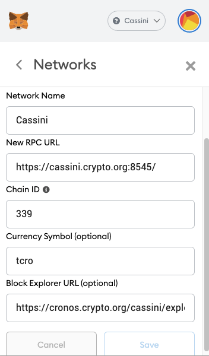

# How to connect Cassini incentivised testnet network

For Metamask users : 

- Insert the network name, for example "**Cassini**" and put 
  - https://cassini.crypto.org:8545/ for **New RPC URL**,
  - `339` for Chain ID, 
  - `tcro` for the symble
  - https://cronos.crypto.org/cassini/explorer/ for the Block explorer URL as below





Afterwards, kindly use the [Cassini Faucet](https://cronos.crypto.org/cassini/faucet) and obtain test cro token

# How to build a full node connecting Cassini incentivised testnet network

## Pre-requisites

### Supported OS

We officially support macOS, Windows and Linux only. Other platforms may work but there is no guarantee. We will extend our support to other platforms after we have stabilized our current architecture.

### Prepare your machine

- To run Cassini testnet nodes, you will need a machine with the following minimum requirements:

  - 4-core, x86_64 architecture processor;
  - 16 GB RAM;
  - 1 TB of storage space.

## Step 1. Get the Cassini testnet binary

::: tip Remarks:
The following is the minimal setup for a **validator node** / **full node**.
:::

To simplify the following step, we will be using **Linux** (Intel x86) for illustration. Binary for
**Mac** ([Intel x86](https://github.com/crypto-org-chain/cronos/releases/download/v0.5.5-testnet/cronos_0.5.5-testnet_Darwin_x86_64.tar.gz) / [M1](https://github.com/crypto-org-chain/cronos/releases/download/v0.5.5-testnet/cronos_0.5.5-testnet_Darwin_arm64.tar.gz))and [Windows](https://github.com/crypto-org-chain/cronos/releases/download/v0.5.5-testnet/cronos_0.5.5-testnet_Windows_x86_64.zip) are also available.

- To install released **Cassini testnet binaries** from github:

  ```bash
  $ curl -LOJ https://github.com/crypto-org-chain/cronos/releases/download/v0.5.5-testnet/cronos_0.5.5-testnet_Linux_x86_64.tar.gz
  $ tar -zxvf cronos_0.5.5-testnet_Linux_x86_64.tar.gz
  ```

  Afterward, you can check the version of `cronosd` by

  ```bash
  $ ./cronosd version
  0.5.5-testnet
  ```

## Step 2. Configure `cronosd`


### Step 2-0 (Optional) Clean up the old blockchain data

- If you have joined other testnet before, you would have to clean up the old blockchain data and start over again, it can be done by running:

  ```bash
  $ ./cronosd unsafe-reset-all
  ```
  and remove the old genesis file by

  ```bash
  $ rm ~/.cronos/config/genesis.json
  ```

Before kick-starting your node, we will have to configure your node so that it connects to the Cronos testnet:

### Step 2-1 Initialize `cronosd`

- First of all, you can initialize cronosd by:


  ```bash
    $ ./cronosd init [moniker] --chain-id cassini_339-1
  ```


  This `moniker` will be the displayed id of your node when connected to Crypto.org Chain network.
  When providing the moniker value, make sure you drop the square brackets since they are not needed.
  The example below shows how to initialize a node named `pegasus-node` :


  ```bash
    $ ./cronosd init pegasus-node --chain-id cassini_339-1
  ```


**NOTE**

  - Depending on your cronosd home setting, the cronosd configuration will be initialized to that home directory. To simply the following steps, we will use the default cronosd home directory `~/.cronos/` for illustration.
  - You can also put the `cronosd` to your binary path and run it by `cronosd`

### Step 2-2 Configure cronosd


- Download and replace the Cronos Testnet `genesis.json` by:

  ```bash
  $ curl https://raw.githubusercontent.com/crypto-org-chain/cassini/main/cassini-network-info/genesis.json > ~/.cronos/config/genesis.json
  ```


- Verify sha256sum checksum of the downloaded `genesis.json`. You should see `OK!` if the sha256sum checksum matches.


  ```bash
  $ if [[ $(sha256sum ~/.cronos/config/genesis.json | awk '{print $1}') = "c84684ee99e7c47f68e1bc17b332d32d7d7b72dd4b747d82898905c4b887d3d8" ]]; then echo "OK"; else echo "MISMATCHED"; fi;

  OK!
  ```


**NOTE**

  - For Mac environment, `sha256sum` was not installed by default. In this case, you may setup `sha256sum` with this command:

    ```bash
    function sha256sum() { shasum -a 256 "$@" ; } && export -f sha256sum
    ```


- In `~/.cronos/config/app.toml`, update minimum gas price to avoid [transaction spamming](https://github.com/cosmos/cosmos-sdk/issues/4527)

  ```bash
  $ sed -i.bak -E 's#^(minimum-gas-prices[[:space:]]+=[[:space:]]+).*$#\1"5000000000000basetcro"#' ~/.cronos/config/app.toml
  ```

- For network configuration, in `~/.cronos/config/config.toml`, please modify the configurations of `persistent_peers`, `create_empty_blocks_interval` and `timeout_commit` by:
  ```bash
  $ sed -i.bak -E 's#^(persistent_peers[[:space:]]+=[[:space:]]+).*$#\1"a4a244577f98336a299b13a0d6ecab4188d3a259@13.214.93.59:26656,12db82ba2ff1ebc893bbe426b3cc10b52934e4aa@13.251.205.205:26656,488a7324154c07ba4fe508642e019a88ecfa482f@3.67.15.54:26656"#' ~/.cronos/config/config.toml
  $ sed -i.bak -E 's#^(create_empty_blocks_interval[[:space:]]+=[[:space:]]+).*$#\1"5s"#' ~/.cronos/config/config.toml
  $ sed -i.bak -E 's#^(timeout_commit[[:space:]]+=[[:space:]]+).*$#\1"5s"#' ~/.cronos/config/config.toml
  ```


## Step 3. Run everything


Once the `cronosd` has been configured, we are ready to start the node and sync the blockchain data:

- Start cronosd, e.g.:

```bash
  $ ./cronosd start
```

::: tip Remarks:
If you see errors saying `too many files opened...`, then you need to set a higher number for maximum open file descriptors in your OS.

If you are on OSX or Linux, then the following could be useful:

```bash
# Check current max fd
$ ulimit -n
# Set a new max fd
$ ulimit -Sn [NEW_MAX_FILE_DESCRIPTOR]
# Example
$ ulimit -Sn 4096
```

:::

- _(Optional for Linux)_ Start cronosd with systemd service, e.g.:

```bash
  $ curl -s https://raw.githubusercontent.com/crypto-org-chain/cronos-docs/master/systemd/create-service.sh -o create-service.sh && curl -s https://raw.githubusercontent.com/crypto-org-chain/cronos-docs/master/systemd/cronosd.service.template -o cronosd.service.template
  $ chmod +x ./create-service.sh && ./create-service.sh
  $ sudo systemctl start cronosd
  # view log
  $ journalctl -u cronosd -f
```

:::details Example: /etc/systemd/system/cronosd.service created by script

```bash
# /etc/systemd/system/cronosd.service
[Unit]
Description=cronosd
ConditionPathExists=/usr/local/bin/cronosd
After=network.target

[Service]
Type=simple
User=ubuntu
WorkingDirectory=/usr/local/bin
ExecStart=/usr/local/bin/cronosd start --home /home/ubuntu/.cronos
Restart=on-failure
RestartSec=10
LimitNOFILE=4096

[Install]
WantedBy=multi-user.target
```

:::

It should begin fetching blocks from the other peers. Please wait until it is fully synced before moving onto the next step.

- You can query the node syncing status by

  ```bash
  $ ./cronosd status 2>&1 | jq '.SyncInfo.catching_up'
  ```

  If the above command returns `false`, It means that your node **is fully synced**; otherwise, it returns `true` and implies your node is still catching up.

- One can check the current block height by querying the public full node by:

  ```bash
  curl -s https://cassini.crypto.org:26657/commit | jq "{height: .result.signed_header.header.height}"
  ```

  and you can check your node's progress (in terms of block height) by

  ```bash
  $ ./cronosd status 2>&1 | jq '.SyncInfo.latest_block_height'
  ```
